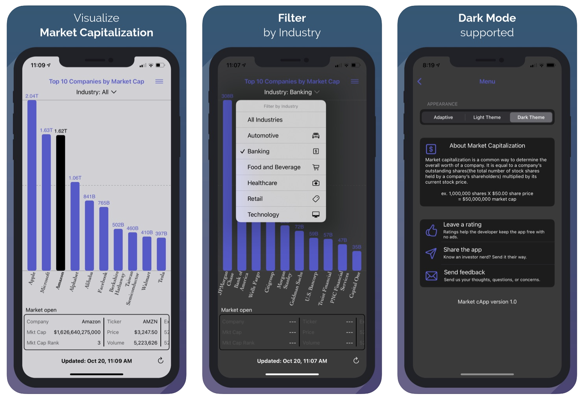

# Market cApp
Open source code for an app on the App Store called Market cApp. The app displays the current value of the top 10 companies available on US stock exchanges as determined by their market capitalization.

**Features:**

-See the most up to date market cap data

-Visualize how top companies compare to each other

-View additional stock data such as price, volume, and 52 week highs and lows

-Fully supports dark mode 

**App Screenshots**

**Links:**

[Market cApp in the App Store](https://apps.apple.com/us/app/id1534974973)

[Inspiration for animated bar charts](https://github.com/nhatminh12369/BarChart)

[App icon source](https://www.flaticon.com/free-icon/financial_2260786)

***Features in the works***

-Filter by date

-Filter by industry

-Saving favorites outside of the current top 10

**Feel free to contribute!**

